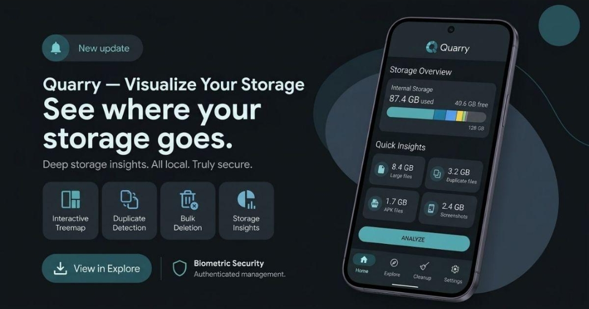
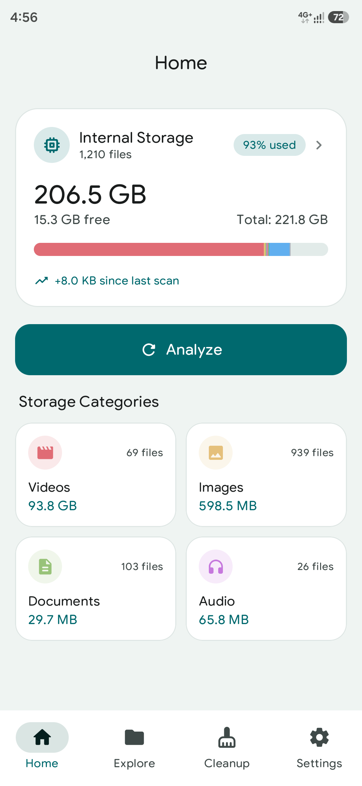
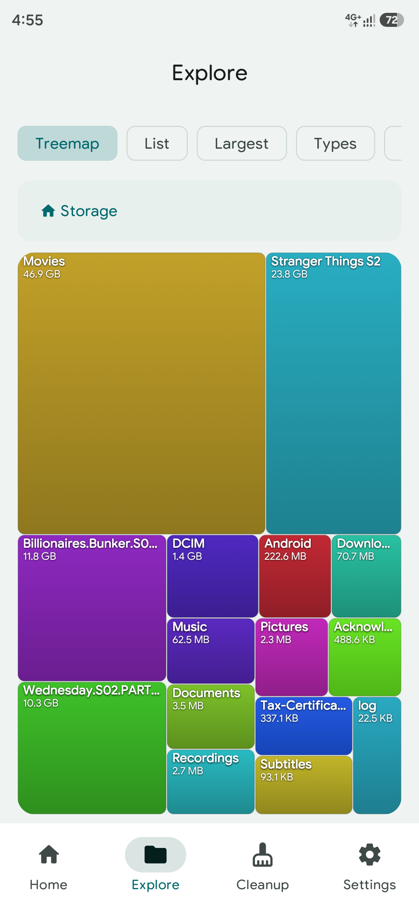
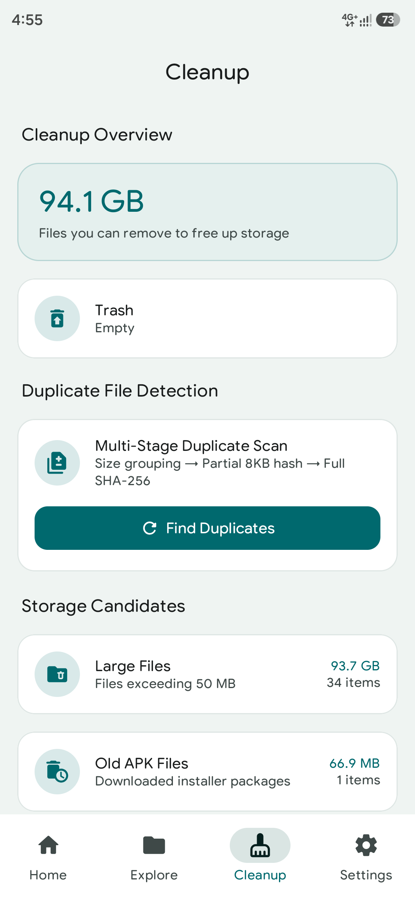
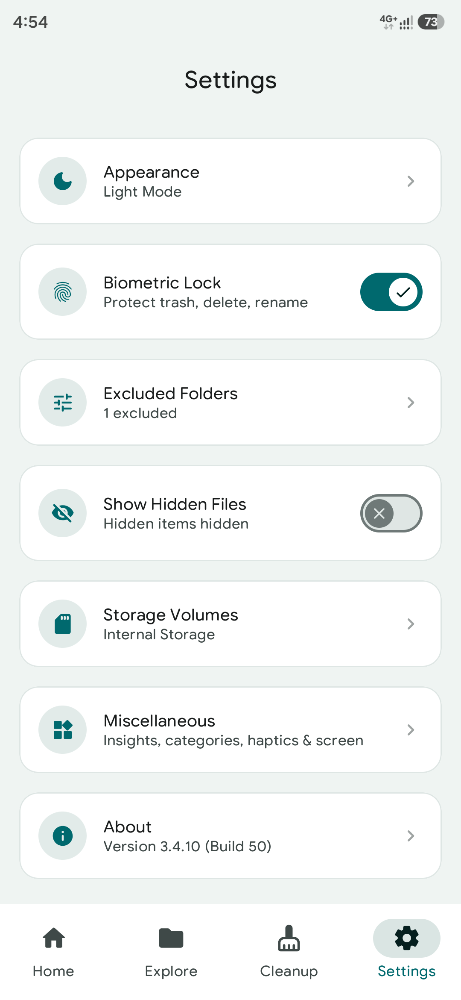

<div align="center">



# Quarry

**See where your device storage really goes**

[-3DDC84?style=flat&logo=android&logoColor=white)](https://developer.android.com)
[](https://kotlinlang.org)
[](https://developer.android.com/jetpack/compose)
[](https://m3.material.io)

<br/>

</div>

---

## Overview

**Quarry** is a modern, fast, and privacy-first Android storage analyzer and disk cleanup utility built with **Jetpack Compose** and **Material 3**. It is purpose-built to help you see what is eating up your storage, explore files visually with treemaps, and clean up space safely.

> [!NOTE]
> **Quarry is not a general-purpose file manager.** It is dedicated specifically to disk space analysis, visualization, and cleanup—not everyday file management like copying, moving, or archiving. All scans and operations run 100% offline on your device.

---

## Screenshots

| | |
| :---: | :---: |
|  |  |
|  |  |

---

## Features

- **Interactive Treemap Visualization**:
  - Hardware-accelerated squarified treemaps with guaranteed minimum tile visibility so small files and directories never collapse into unclickable slivers.
  - Proximity-aware single-tap folder navigation and file inspection.
  - Distinct, vibrant HSL gradient colors and labels for every file and folder.
- **Versatile Storage Explorer**:
  - Switch seamlessly between Treemap, List, Largest Files, Categories/Types, and Folders views.
  - Breadcrumb navigation with hierarchical directory traversal and system back integration.
  - Smart search with real-time keyword matching across files and categories.
  - Compact modal filter sheet with multi-criteria sorting (Size, Name, Date, Type), ascending/descending order, and hidden dotfile visibility.
  - Multi-select batch actions for Trash and permanent Deletion.
- **Native File Thumbnails**:
  - High-performance, offline visual previews for images, video frames, and APK application badges with in-memory LRU caching and zero third-party dependencies.
- **Smart Cleanup Hub**:
  - Redesigned Hero overview card with instant potential space recovery metrics.
  - Identify and safely clean duplicate files with collapsible group sets and recoverable space badges.
  - Discover large files occupying significant storage.
  - Locate obsolete APK packages, empty directories, and orphaned caches.
  - Fast Trash management with countdown confirmation and single-tap purge.
- **Full-Screen Settings & Management**:
  - Appearance dialog with live theme preview cards (System, Light, Dark, Dynamic Material You).
  - Excluded Folders manager with preset chips and custom folder selection.
  - Storage Volumes overview with capacity statistics and filesystem capability badges.
  - **Miscellaneous** — Quick Insights show/hide, Storage Categories visibility (≥4 required), Haptic feedback with strength slider, and Keep Screen On while the app is open.
- **Biometric Security**: Protect file browsing and sensitive storage details using device biometric authentication or PIN lock.
- **Personalized Home**: Toggle Quick Insights and curate which Storage Category cards appear on Home; enforce a minimum of four visible categories so the grid never collapses.
- **Haptics & Display**: Centralized vibration helper with strength control (Low/Medium/High/Strong) backed by `VibrationEffect` amplitude, and a keep-screen-on toggle that uses `FLAG_KEEP_SCREEN_ON`.
- **100% Offline & Private**: Zero tracking, zero analytics, zero network data transmission. All scanning and analysis stay on your device.

---

## Tech Stack & Architecture

Quarry is built following **Clean Architecture** and **Unidirectional Data Flow (UDF)** with modern Android development standards:

| Component | Technology |
| :--- | :--- |
| **Language** | [Kotlin 2.2.21](https://kotlinlang.org/) |
| **UI Framework** | [Jetpack Compose](https://developer.android.com/jetpack/compose) (BOM `2026.06.01`) + Material 3 |
| **Typography** | [Google Sans Rounded](https://fonts.google.com/) (Embedded `res/font/`) |
| **Navigation** | [Compose Navigation](https://developer.android.com/guide/navigation/navigation-compose) |
| **Local Database** | [Room Database 2.8.4](https://developer.android.com/training/data-storage/room) with [KSP](https://kotlinlang.org/docs/ksp-overview.html) |
| **User Preferences** | [Jetpack DataStore Preferences](https://developer.android.com/topic/libraries/architecture/datastore) |
| **Background Tasks** | [Jetpack WorkManager 2.10.0](https://developer.android.com/topic/libraries/architecture/workmanager) |
| **Concurrency** | [Kotlinx Coroutines & Flow](https://github.com/Kotlin/kotlinx.coroutines) |
| **Security** | [AndroidX Biometric 1.2.0](https://developer.android.com/jetpack/androidx/releases/biometric) |
| **Build & CI/CD** | Gradle Kotlin DSL (`build.gradle.kts`), Java 21, GitHub Actions CI + Telegram Release Bot |

---

## Project Structure

```
quarry-app/
├── .github/
│   ├── scripts/bot.py            # CI Telegram bot & release manager
│   └── workflows/build.yml       # GitHub Actions build & release pipeline
├── app/
│   ├── build.gradle.kts          # Module build configuration
│   └── src/main/
│       ├── AndroidManifest.xml
│       ├── java/app/quarry/tanvir/info/
│       │   ├── MainActivity.kt   # App root & theme provider
│       │   ├── MainViewModel.kt  # App UI state & global preference holder
│       │   ├── QuarryApp.kt      # Application initialization
│       │   ├── data/             # Database, preferences & repositories
│       │   ├── domain/           # Analyzer, app analysis, cleanup, duplicates, media, scanner, security, treemap, volumes
│       │   ├── ui/               # Compose screens & components (cleanup, explore, home, settings, navigation, theme)
│       │   └── worker/           # Background workers
│       └── res/                  # Drawables, strings, mipmaps
└── AGENTS.md                     # Agent & developer guidelines
```

---

## Getting Started

### Prerequisites
- **JDK 21** or later
- **Android Studio** (Ladybug / Meerkat or newer recommended)
- Android SDK with Platform `android-36` installed

### Build & Run Locally
1. Clone the repository:
   ```bash
   git clone https://github.com/tanvirr007/quarry-app.git
   cd quarry-app
   ```
2. Build the debug APK:
   ```bash
   ./gradlew assembleDebug
   ```
3. Run unit tests:
   ```bash
   ./gradlew test
   ```

---

## Continuous Integration & Releases

Automated builds and GitHub Releases are powered by GitHub Actions ([`.github/workflows/build.yml`](.github/workflows/build.yml)):
- **Semantic Versioning**: Automatically calculates version tags based on previous releases and Gradle configuration.
- **Signed APKs**: Automatically signs release builds when signing secrets are configured.
- **Telegram Notifications**: Real-time compilation status and release dispatches via Telegram bot integration.

## Reporting Issues & Contributing

Contributions and bug reports are welcome to make Quarry better.

- **[Report a Bug](https://github.com/tanvirr007/quarry-app/issues/new?template=bug_report.yml)**
- **[Request a Feature](https://github.com/tanvirr007/quarry-app/issues/new?template=feature_request.yml)**
- **[Browse All Issues](https://github.com/tanvirr007/quarry-app/issues)**

### Reporting a Bug
When reporting a bug via the [Bug Report form](https://github.com/tanvirr007/quarry-app/issues/new?template=bug_report.yml), please provide:
- **Quarry Version**: The version number and build number (e.g. `v1.0.0`).
- **Device Details**: Device model, manufacturer, and Android OS version / custom ROM.
- **Permission State**: Whether "All Files Access" (`MANAGE_EXTERNAL_STORAGE`) was granted.
- **Steps to Reproduce**: Clear, numbered step-by-step instructions to reproduce the issue.
- **Observed vs. Expected**: What happened versus what you expected to happen.
- **Logs / Screenshots**: Logcat output or crash stack traces if applicable.

Before opening a new issue, please [search existing issues](https://github.com/tanvirr007/quarry-app/issues) to avoid duplicates.

### Requesting Features
To suggest new features or enhancements, please submit a [Feature Request](https://github.com/tanvirr007/quarry-app/issues/new?template=feature_request.yml) describing your use case, proposed solution, and any alternatives considered.

---

## License

```
Copyright 2026 Tanvir Hasan

Licensed under the Apache License, Version 2.0 (the "License");
you may not use this file except in compliance with the License.
You may obtain a copy of the License at

    http://www.apache.org/licenses/LICENSE-2.0

Unless required by applicable law or agreed to in writing, software
distributed under the License is distributed on an "AS IS" BASIS,
WITHOUT WARRANTIES OR CONDITIONS OF ANY KIND, either express or implied.
See the License for the specific language governing permissions and
limitations under the License.
```